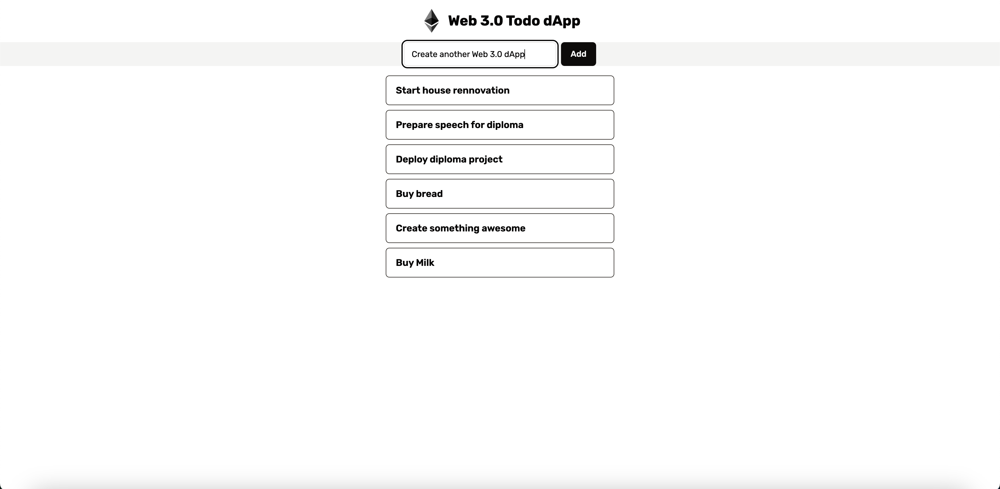

# Web 3.0 Todo dApp

  
  
  
  

  A simple todolist which does its all actions e.g. creation, getting, deleting in the <b>Smart Contract</b>. Purpose was jsut creating a simple <b>Smart Contract</b> with different functions and use them on <i>frontend</i>.

